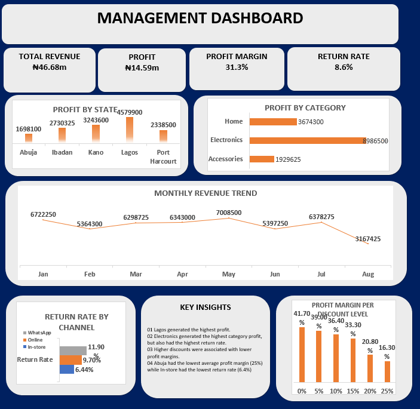

# Sales Dashboard Audit — DSN AI Bootcamp 2026 (Data Analytics track)

**Tools:** Excel (data cleaning, PivotTables, dashboard)  
**Dataset:** 420 retail sales transactions (product, state, quantity, price, cost)

## The task
Management shared a sales dashboard and 8 claims about business performance.
My job: audit the data, fix the dashboard, and confirm or reject each claim with evidence.

## What I found
- **12 exact duplicate rows** (432 → 420 transactions after removal).
- **31 missing cost values**, which made profit look higher than it was.
- **22 transactions (5.1%)** where reported revenue ≠ Units × Unit Price × (1 − Discount).
- Inconsistent state/category labels (e.g. "Lagos", "Lagos ", "LAGOS") that split one market into three.
- Corrected revenue: **₦46,679,725** · Corrected profit: **₦14,590,425** (originally ₦16,617,270 — overstated by ~₦2.0M).
- Result: all 8 management claims failed the audit (6 incorrect, 2 misleading) — including "Lagos is underperforming" (it was actually the most profitable state, ₦4.58M).

## What I did
1. Removed duplicate rows and filled/flagged missing cost values.
2. Recomputed revenue and profit from source columns instead of trusting the pasted totals.
3. Rebuilt the dashboard: KPI cards, revenue by product & state, profit margin, trend.
4. Tested all 8 management claims against the cleaned data — verdicts and evidence are in the report.

## Files
- [MercyIjegbai_DataAnalytics_FinalProject.xlsx](MercyIjegbai_DataAnalytics_FinalProject.xlsx) — cleaned data + dashboard
- [dashboard.png](dashboard.png) — dashboard snapshot
- [report.pdf](report.pdf) — written audit report with claim-by-claim verdicts

## What I learned
Never trust a dashboard's totals until you've recomputed them from the raw rows.
